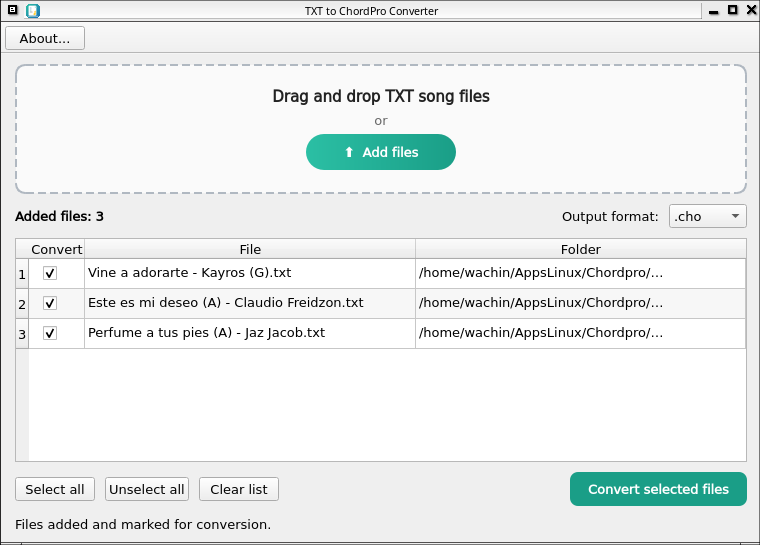

# TXT to ChordPro Converter

---

**Tutorial en español:**
[README_ES.md](README_ES.md)

---

PyQt6 GUI application to convert church TXT chord sheets from [https://github.com/wachin/Cancionero](https://github.com/wachin/Cancionero)  (under "Acordes(63x110mm)" folder) into valid ChordPro files.

## Features

- Convert multiple TXT song files at the same time
- Drag and drop support
- File selection table with checkboxes
- Select or unselect files before conversion
- Converts section headers like:

```text
[Verse]
[Chorus]
[Intro]
```

into valid ChordPro comments:

```chordpro
{comment: Verse}
{comment: Chorus}
{comment: Intro}
```

- Automatically converts chords above lyrics into inline ChordPro chords
- Reads:
  - first line = song title
  - second line = artist name
- Automatically extracts musical key from titles like:

```text
Amazing Grace (G)
```

- Export to:
  - `.cho`
  - `.chopro`

---

# Screenshots

The application includes:

- Central drag and drop area
- Multi-file conversion table
- Checkbox selection system
- Output format selector
- About dialog with developer information

---

# Requirements

## Linux (Debian / Ubuntu / MX Linux)

Install dependencies:

```bash
sudo apt update

sudo apt install python3 python3-pyqt6 \
                 python3-pyqt6.qtsvg
```

Run the program:

```bash
python3 txt_to_chordpro_gui.py
```



---

## Windows

Install Python 3 from:

https://www.python.org/

During installation, add it to the PATH

Then install PyQt6:

```bash
pip install PyQt6
```

Run:

```bash
python txt_to_chordpro_gui.py
```

---

## macOS

Install Python 3 and PyQt6:

```bash
pip3 install PyQt6
```

Run:

```bash
python3 txt_to_chordpro_gui.py
```

---

# Example Input

```text
Amazing Grace (G)
John Newton

[Verse]
G          C
Amazing grace
```

# Example Output

```chordpro
{title: Amazing Grace}
{artist: John Newton}
{key: G}

{comment: Verse}
[G]Amazing [C]grace
```

---

# Developer

Washington Indacochea Delgado

GitHub:
[https://github.com/wachin/](https://github.com/wachin/)

Email:
[linuxfrontier@proton.me](linuxfrontier@proton.me)

---

# License

This project is free software and open source GPL 3
